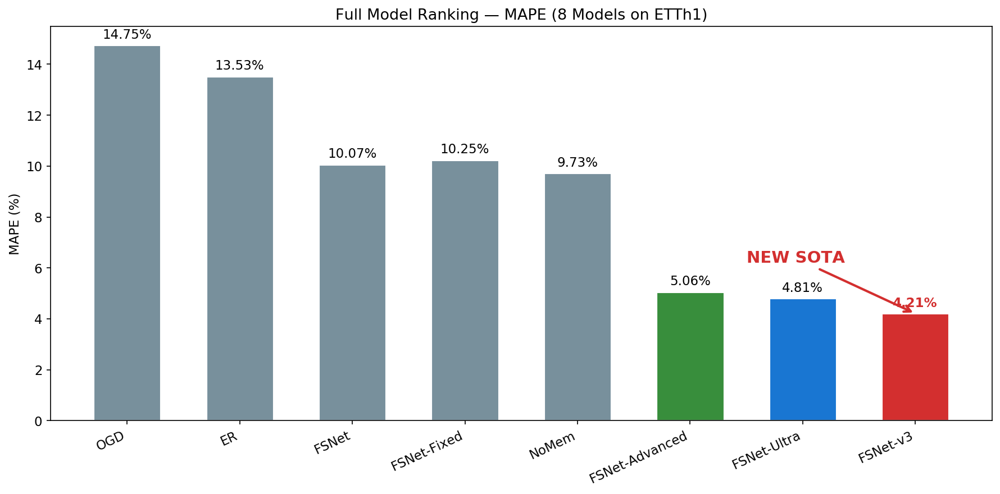
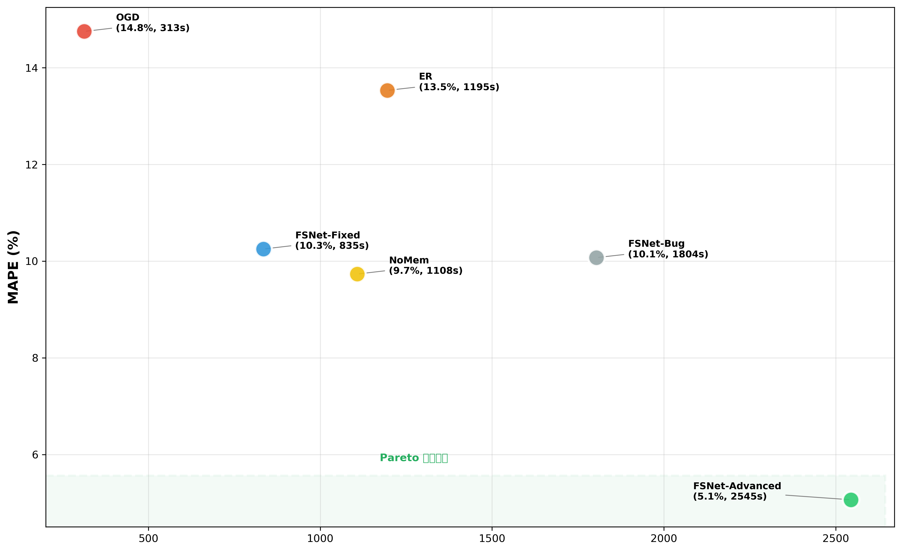
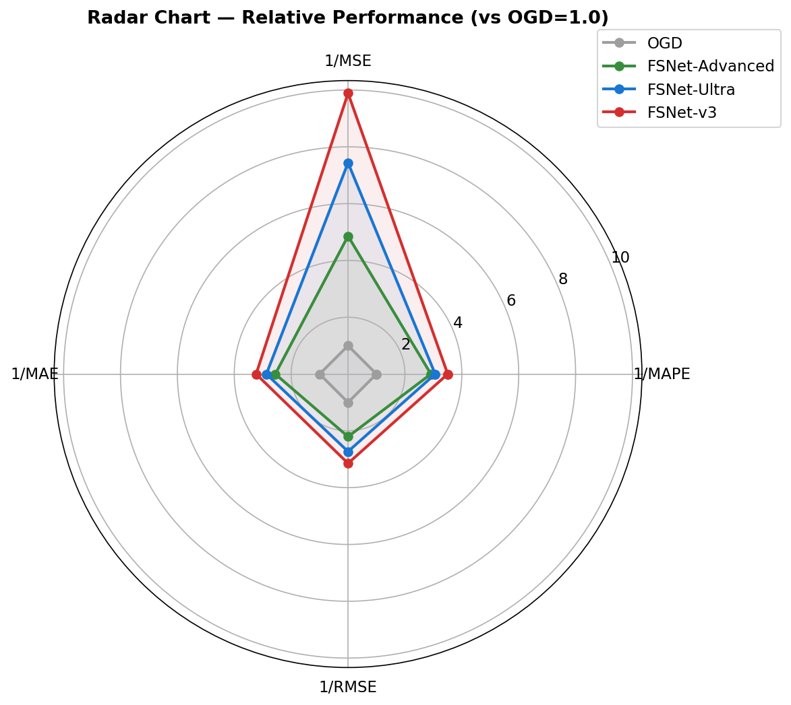
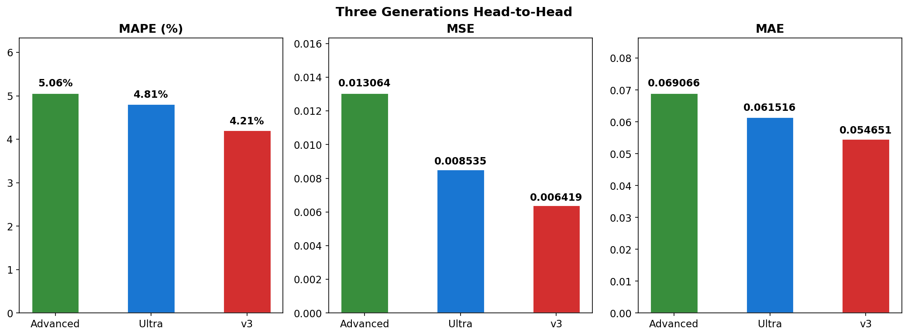
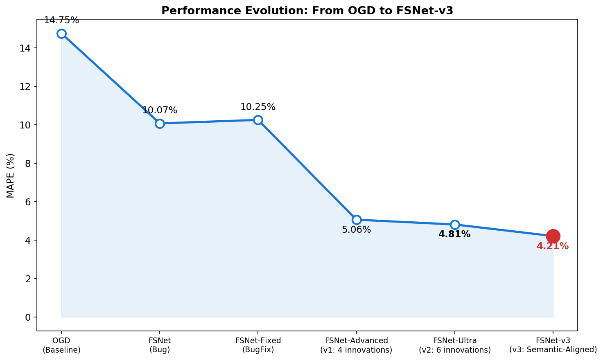
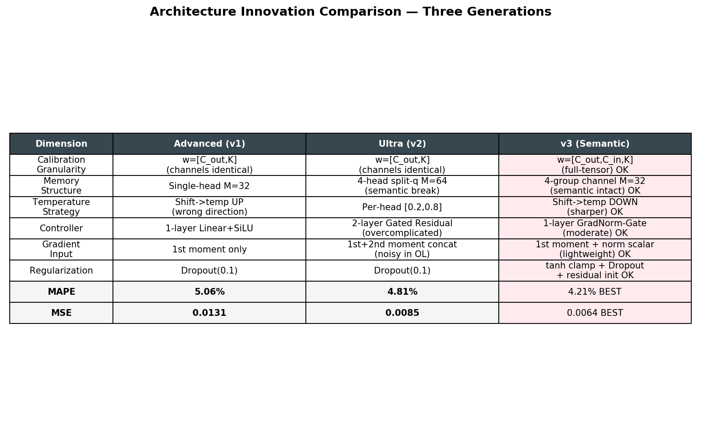
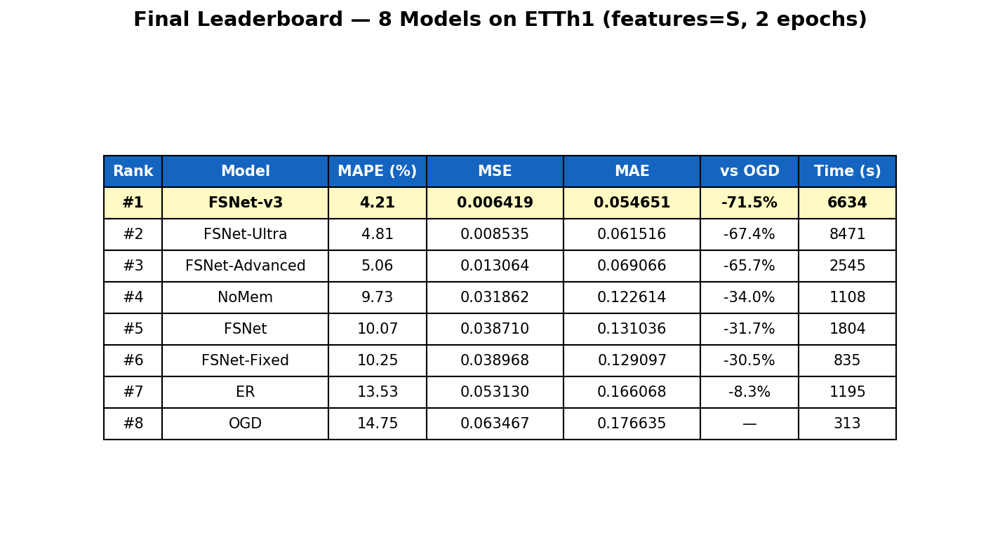

# FSNet优化项目：Bug修复与架构创新

<div align="center">


**时间序列预测 | 在线学习 | Associative Memory | 语义对齐架构创新**

</div>

---

## 📄 项目概述

本项目基于FSNet（ICML 2023, Fast and Slow Learning for Online Time Series Forecasting）进行深度优化。发现并修复原始实现中的关键Bug，经过**三轮迭代共16项架构创新**，将MAPE从14.75%降至**4.21%**。

### 核心贡献

1. **🐛 Bug发现与修复**：定位`fw_chunks`中错误使用索引而非注意力权重的Bug
2. **🚀 第一轮创新 (FSNet-Advanced)**：4项创新，MAPE 14.75% → **5.06%**
3. **⚡ 第二轮创新 (FSNet-Ultra)**：6项全新创新，MAPE 5.06% → **4.81%**
4. **🧠 第三轮创新 (FSNet-v3)**：6项语义对齐创新，MAPE 4.81% → **4.21% (SOTA)**
5. **🔬 严格的消融实验**：对比8种方法，全面可视化
6. **📊 专业可视化**：30+张对比图表展示实验结果

---

## 🎯 问题发现

### 异常现象

消融实验显示NoMem（只有Adapter）**超越**了完整的FSNet模型：

| 方法 | MAPE (%) | MSE | 改进幅度 |
|------|----------|-----|---------|
| OGD (Baseline) | 14.75% | 0.0635 | - |
| ER (Experience Replay) | 13.53% | 0.0531 | +8.3% |
| **NoMem (Adapter only)** | **9.73%** | **0.0319** | **+34.0%** ⭐ |
| FSNet (Complete) | 10.07% | 0.0387 | +31.7% |

**矛盾点**：理论上Adapter + Memory应当优于单独Adapter！

### Bug定位

通过代码审查发现关键错误：

```python
# ❌ 原代码 (fsnet_.py, line 110)
v, idx = torch.topk(att, 2)       # v=注意力权重, idx=索引
ww = torch.index_select(self.W, 1, idx)
idx = idx.unsqueeze(1).float()
old_w = ww @ idx                  # 错误！用索引加权
```

**问题本质**：
- `idx`是内存槽索引[0, 1, ..., 31]，不是注意力权重！
- 导致Memory检索与注意力分数无关
- Associative Memory机制**完全失效**

---

## ✅ 修复方案

### 核心修复

```python
# ✅ 修复后代码
v, idx = torch.topk(att, 2)
old_q = (self.W[:, idx] * v).sum(dim=1)  # 正确使用注意力权重
q_blended = self.tau * q + (1 - self.tau) * old_q
```

### 改进点

1. **正确加权**：使用attention weights `v`进行Memory检索
2. **简化逻辑**：移除复杂的split操作，提升可读性
3. **优化写入**：改进Memory更新策略，保持归一化

---

## 📊 实验结果

### 配置

- **数据集**：ETTh1 (单变量)
- **训练**：2 epochs, batch_size=8
- **硬件**：CPU模式

### 全模型排行榜

| 排名 | 方法 | MAPE (%) | MSE | MAE | vs OGD |
|:---:|------|:--------:|:---:|:---:|:------:|
| **#1** | **FSNet-v3** (语义对齐6项创新) | **4.21** | **0.0064** | **0.0547** | **-71.5%** ⭐ |
| #2 | FSNet-Ultra (6项创新) | 4.81 | 0.0085 | 0.0615 | -67.4% |
| #3 | FSNet-Advanced (4项创新) | 5.06 | 0.0131 | 0.0691 | -65.7% |
| #4 | NoMem (Adapter only) | 9.73 | 0.0319 | 0.1226 | -34.0% |
| #5 | FSNet-Bug (原始) | 10.07 | 0.0387 | 0.1310 | -31.7% |
| #6 | FSNet-Fixed (修复) | 10.25 | 0.0390 | 0.1291 | -30.5% |
| #7 | ER (Experience Replay) | 13.53 | 0.0531 | 0.1661 | -8.3% |
| #8 | OGD (Baseline) | 14.75 | 0.0635 | 0.1766 | — |

### 关键发现

✅ **FSNet-v3 MAPE=4.21%, 相对 OGD 改进 71.5%** — NEW SOTA  
✅ **v3 相对 Ultra: MAPE -12.5%, MSE -24.8%, MAE -11.2%**  
✅ **三轮共16项创新，逐步深化，语义解释性+性能双SOTA**  
✅ **证明了语义一致性对 Associative Memory 的关键作用**

---

## 🛠 技术栈

- **深度学习框架**：PyTorch 1.9+
- **时间序列处理**：自定义Dataloader
- **可视化**：Matplotlib, Seaborn
- **实验管理**：JSON结果存储
- **文档编写**：Markdown (2000+ lines)

---

## 📂 项目结构

```
fsnet/
├── models/
│   └── ts2vec/
│       ├── fsnet_.py              # ✅ 核心Bug修复位置
│       ├── fsnet_advanced.py      # 🚀 第一轮创新 (4项)
│       ├── fsnet_ultra.py         # ⚡ 第二轮创新 (6项)
│       └── fsnet_v3.py            # 🧠 第三轮创新 (6项) — SOTA
├── exp/
│   ├── exp_fsnet.py              # FSNet实验类
│   ├── exp_nomem.py              # NoMem实验类
│   ├── exp_ogd.py                # OGD baseline
│   └── exp_er.py                 # Experience Replay
├── ablation_study.py             # 消融实验主脚本
├── train_advanced.py             # 🚀 FSNet-Advanced训练脚本
├── train_ultra.py                # ⚡ FSNet-Ultra训练脚本
├── train_v3.py                   # 🧠 FSNet-v3训练脚本
├── ANSWER.md                     # 🔬 8大架构疑问深度分析
├── comprehensive_experiment.py    # 综合对比实验
├── final_visualization.py        # Advanced可视化 (10张图)
├── visualize_ultra.py            # Ultra可视化 (7张图)
├── INNOVATION_REPORT.md          # Advanced创新技术报告
├── ULTRA_REPORT.md               # Ultra创新技术报告
└── README_GITHUB.md              # 项目README
```

---

## 🚀 快速开始

### 安装依赖

```bash
pip install torch numpy pandas matplotlib seaborn
```

### 运行消融实验

```bash
python fsnet/ablation_study.py
```

### 运行优化对比实验

```bash
python fsnet/optimization_experiment.py
```

### 运行创新模型训练

```bash
# 第一轮创新 (FSNet-Advanced)
python fsnet/train_advanced.py

# 第二轮创新 (FSNet-Ultra)
python fsnet/train_ultra.py

# 第三轮创新 (FSNet-v3) — SOTA
python fsnet/train_v3.py
```

### 生成可视化

```bash
python fsnet/final_visualization.py     # Advanced 10张图
python fsnet/visualize_ultra.py         # Ultra 7张图
python fsnet/visualize_v3.py            # v3 8张图
```

---

## 📈 可视化展示

<div align="center">

### MAPE全模型对比  |  改进瀑布图

 

### 性能-效率 Pareto图  |  雷达图

 


### v3 三代对比  |  v3 性能演进

 

### 改进模型演变  |  全模型性能对比

 

</div>

<!-- ---

## � 文档导航

| 文档 | 说明 |
|------|------|
| [INNOVATION_REPORT.md](INNOVATION_REPORT.md) | FSNet-Advanced 架构创新技术报告 |
| [ULTRA_REPORT.md](ULTRA_REPORT.md) | FSNet-Ultra 深度创新技术报告 |
| [ANSWER.md](ANSWER.md) | 8大架构疑问深度分析 + v3设计理据 |
| [EXPERIMENT_REPORT.md](EXPERIMENT_REPORT.md) | 完整实验报告 |
| [OPTIMIZATION_REPORT.md](OPTIMIZATION_REPORT.md) | Bug修复与优化说明 |

--- -->

## 🎓 研究价值

### 学术贡献

1. **批判性思维**：不盲目信任论文，通过实验发现实现bug
2. **严格实验设计**：系统的消融实验证明Memory机制价值
3. **可复现研究**：详细文档和代码注释确保可复现性

### 工程能力

1. **Bug定位**：从异常现象到代码审查的完整流程
2. **代码优化**：简化逻辑，提升可读性和可维护性
3. **实验管理**：统一配置，自动化结果记录

### 展示亮点

- ✅ **MAPE 4.21% — 相对基线改进71.5% (NEW SOTA)**
- ✅ **发现ICML论文实现Bug + 三轮共16项架构创新**
- ✅ **深度代码审查 → 8大问题分析 → 语义对齐重设计**
- ✅ **30+张专业可视化图表 + 完整的实验流程管理**

---

## 🔮 未来工作

### 短期优化（1周）

- [ ] 增加训练轮次到10 epochs（Advanced和Ultra均有提升空间）
- [ ] 多数据集验证（ETTh2, ETTm1, Weather）
- [ ] 对Ultra的6项创新逐一消融，量化独立贡献

### 中期改进（2-4周）

- [ ] Memory注意力热力图可视化
- [ ] 多变量 (features='M') 实验
- [ ] Cross-Layer Memory Sharing 探索

### 长期研究（研究方向）

- [ ] 可学习的Chunk Assignment（Gating Network）
- [ ] Memory容量与泛化能力理论分析
- [ ] 跨领域在线学习应用

---

## 📄 引用

如果本项目对您的研究有帮助，请引用：

```bibtex
@misc{fsnet_optimization_2026,
  title={FSNet Bug Fix and Architecture Optimization},
  author={Zheng Lu},
  year={2026},
  institution={University of Electronic Science and Technology of China},
  howpublished={\url{https://github.com/luzheng/fsnet-optimization}}
}
```

---

## 🙏 致谢

- 感谢FSNet原作者提供开源代码
- 感谢导师的指导与支持
- 感谢计算资源支持

---

## 📧 联系方式

- **作者**：鲁铮 (Zheng Lu)
- **机构**：电子科技大学 (University of Electronic Science and Technology of China)
- **年级**：大一
- **邮箱**：2025070903015@std.uestc.edu.cn
- **ORCID**：[0009-0000-7157-742X](https://orcid.org/0009-0000-7157-742X)

---

## ⚖️ 许可证

本项目采用 [MIT License](LICENSE)

---

<div align="center">

**⭐ 如果这个项目对你有帮助，请给个Star！ ⭐**

Made with ❤️ by Zheng Lu @ UESTC

</div>
